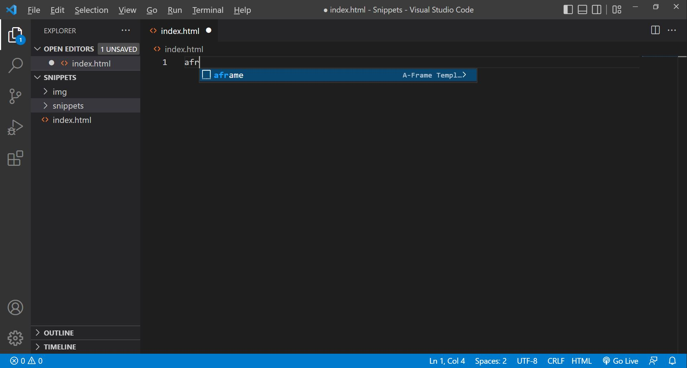

# A-Frame Snippets


### **Description / Rationale**
This repo contains several snippets related to A-Frame used in Visual Studio Code Environment, which can help in faster prototyping/development.

### **Instructions**
1. Open Visual Studio Code.
2.	Ctrl + Shift + P to run “Command Palette…” (“View” > “Command Palette…”)
3.	Type: “Configure User Snippets” and hit “enter”
3.	Type: “html.json” and hit “enter”
4.	In the appearing window, copy the snippet code:
```
{
    "A-Frame Template": {
        "prefix": "aframe",
        "body": [
            "<html>",
                "\t<head>",
                "\t<script src='https://aframe.io/releases/1.3.0/aframe.min.js'></script>",
                "\t</head>",
                "\t<body>",
                    "\t\t<a-scene>",
                        "\t\t\t<a-box position='-1 0.5 -3' rotation='0 45 0' color='#4CC3D9'></a-box>",
                        "\t\t\t<a-sphere position='0 1.25 -5' radius='1.25' color='#EF2D5E'></a-sphere>",
                        "\t\t\t<a-cylinder position='1 0.75 -3' radius='0.5' height='1.5' color='#FFC65D'></a-cylinder>",
                        "\t\t\t<a-plane position='0 0 -4' rotation='-90 0 0' width='4' height='4' color='#7BC8A4'></a-plane>",
                        "\t\t\t<a-sky color='#ECECEC'></a-sky>",
                    "\t\t</a-scene>",
                "\t</body>",
            "</html>"
        ],
        "description": "A-Frame snippet"
    },
    "MindAr.js Template": {
        "prefix": "mindar",
        "body": [
            "<html>",
                "\t<head>",
                "\t<meta name='viewport' content='width=device-width, initial-scale=1' />",
                "\t<script src='https://aframe.io/releases/1.3.0/aframe.min.js'></script>",
                "\t<script src='https://cdn.jsdelivr.net/gh/hiukim/mind-ar-js@1.1.4/dist/mindar-image.prod.js'></script>",
                "\t<script src='https://cdn.jsdelivr.net/gh/hiukim/mind-ar-js@1.1.4/dist/mindar-image-aframe.prod.js'></script>",
                "\t</head>",
                "\t<body>",
                    "\t\t<a-scene mindar-image='imageTargetSrc: https://cdn.jsdelivr.net/gh/hiukim/mind-ar-js@1.1.4/examples/image-tracking/assets/card-example/card.mind;' vr-mode-ui='enabled: false' device-orientation-permission-ui='enabled: false'>",
                        "\t\t\t<a-camera position='0 0 0' look-controls='enabled: false'></a-camera>",
                        "\t\t\t<a-entity mindar-image-target='targetIndex: 0'>",
                        "\t\t\t\t<a-plane color='blue' opaciy='0.5' position='0 0 0' height='0.552' width='1' rotation='0 0 0'></a-plane>",
                        "\t\t\t</a-entity>",
                        "\t\t</a-scene>",
                "\t</body>",
            "</html>"
        ],
        "description": "MindAr.js snippet"
    }
}
```

To test it, in Visual Studio Code write "aframe" or "mindar" and hit "enter".
